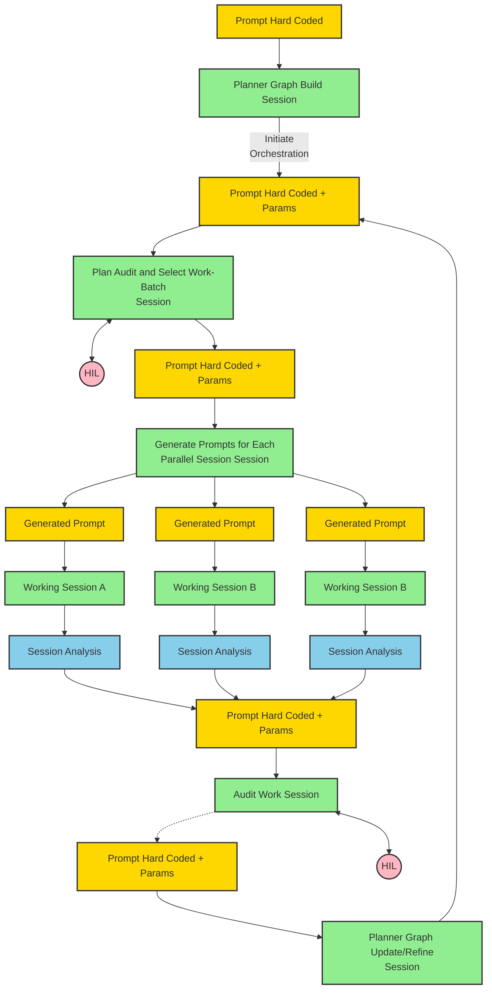

```mermaid
graph TD
    %% Style definitions
    classDef prompt fill:#FFD700,stroke:#333,stroke-width:2px
    classDef session fill:#90EE90,stroke:#333,stroke-width:2px
    classDef analysis fill:#87CEEB,stroke:#333,stroke-width:2px
    classDef human fill:#FFB6C1,stroke:#333,stroke-width:2px
    
    %% Initial build phase
    prompt0["Prompt Hard Coded"]:::prompt
    buildSession["Planner Graph Build Session"]:::session
    
    %% Update/Refine phase
    prompt1["Prompt Hard Coded + Params"]:::prompt
    updateSession["Planner Graph Update/Refine<br/>Session"]:::session
    
    %% Plan audit phase
    prompt2["Prompt Hard Coded + Params"]:::prompt
    audit["Plan Audit and Select Work-Batch<br/>Session"]:::session
    hil1((HIL)):::human
    
    %% Generate prompts phase
    prompt3["Prompt Hard Coded + Params"]:::prompt
    generate["Generate Prompts for Each<br/>Parallel Session Session"]:::session
    
    %% Generated prompts
    genPrompt1["Generated Prompt"]:::prompt
    genPrompt2["Generated Prompt"]:::prompt
    genPrompt3["Generated Prompt"]:::prompt
    
    %% Working sessions
    workA["Working Session A"]:::session
    workB1["Working Session B"]:::session
    workB2["Working Session B"]:::session
    
    %% Session analyses
    analysisA["Session Analysis"]:::analysis
    analysisB1["Session Analysis"]:::analysis
    analysisB2["Session Analysis"]:::analysis
    
    %% Final audit
    prompt4["Prompt Hard Coded + Params"]:::prompt
    finalAudit["Audit Work Session"]:::session
    hil2((HIL)):::human
    
    %% Connections
    prompt0 --> buildSession
    buildSession -->|Initiate<br/>Orchestration| prompt2
    prompt1 --> updateSession
    updateSession --> prompt2
    prompt2 --> audit
    audit <--> hil1
    audit --> prompt3
    prompt3 --> generate
    
    generate --> genPrompt1
    generate --> genPrompt2
    generate --> genPrompt3
    
    genPrompt1 --> workA
    genPrompt2 --> workB1
    genPrompt3 --> workB2
    
    workA --> analysisA
    workB1 --> analysisB1
    workB2 --> analysisB2
    
    analysisA --> prompt4
    analysisB1 --> prompt4
    analysisB2 --> prompt4
    
    prompt4 --> finalAudit
    finalAudit <--> hil2
    
    %% Loop back arrow from final audit to update/refine
    finalAudit -.-> prompt1
```